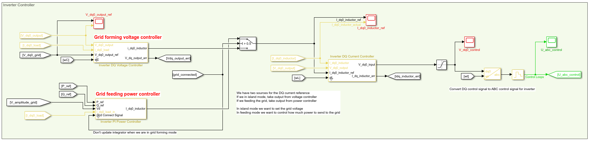
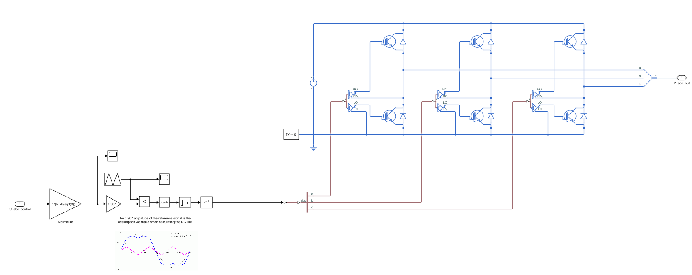
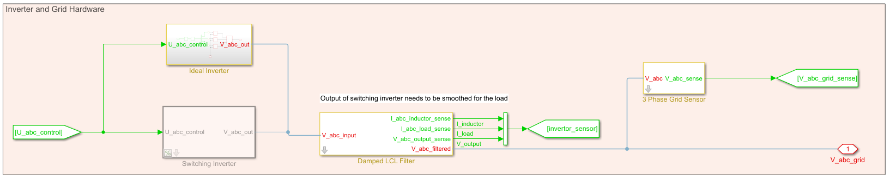
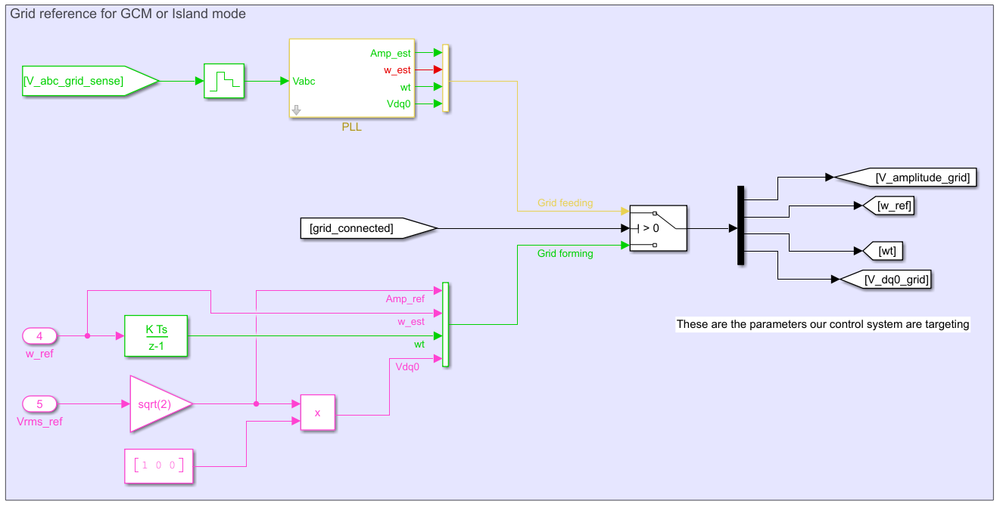

## Introduction
Implementation of a three phase microinverter grid with grid forming or grid feeding.

## Operation modes
1. Grid Forming
- Reference frequency and amplitude are given for grid voltage
- Apply DQ transform to grid voltage reference
- Inverter targets DQ voltage reference using voltage and current controller in a closed loop scheme

2. Grid Feeding
- Reference real and reactive power (PQ) are given for inverter output
- Inverter output is connected to an external grid
- Apply three phase PLL to get frequency relative to 50Hz
- Inverter targets PQ power reference and offset frequency using power and current controller in a closed loop scheme

## Completed microinverter setup
The setup used to test the microinverters in grid forming or feeding mode includes:
- Global grid
- Inverter 1 and three phase load connected to global grid using switch 1
- Inverter 2 connected to inverter 1 microgrid using switch 2 

The test configurations include:
- Inverter 1 as grid forming powering three phase load with switch 1 and 2 open
- Inverter 2 as grid feeding connected to inverter 1 grid with switch 2 closed
- Inverter 1 and 2 as grid feeding connected to global grid with switch 1 and 2 closed

## Files
| File | Description |
| --- | --- |
| **completed_microinverter_setup.slx** | **Simulink file containing microinverter block and test grid** |
| **q4.m** | **Script to initialise variables for completed_microinverter_setup.slx simulink file.** This is code for the outstanding requirement. |
| three_phase_inverter_dq_control.slx | Simulink file containing a basic current and voltage controller for an inverter under load |
| three_phase_pll_real.slx | Simulink file containing a three phase PLL |
| q1.m | Code for basic requirements |
| q2.m | Code for satisfactory requirements |
| q3.m | Code for high requirements |
| doc/*.pdf | Background literature for developing three phase inverter controllers in a microgrid |

## Gallery

